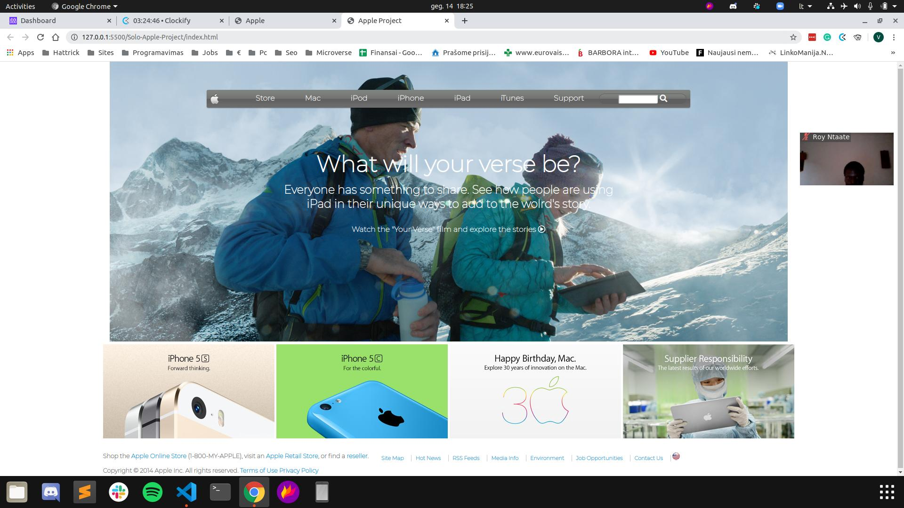

# Solo-Apple-Project

Building with Backgrounds and Gradients Project

The page tries to replicate as much as possible the old version of Apple page Web page.

## Built With

- Html,
- CSS

## Live Demo

[Live Demo Link](https://rawcdn.githack.com/visva-dev/Solo-Apple-Project/6a8a9ad4537f080da647ae7fbd5ba913bacd8a13/index.html)

## Authors

👤 **Visvaldas Rapalis**

- Github: [@visva-dev](https://github.com/visva-dev)
- Twitter: [@Visva_Dev](https://twitter.com/Visva_Dev)
- Linkedin: [@Visvaldas-Rapalis](https://www.linkedin.com/in/visvaldas-rapalis-009797b9/)

## 🤝 Contributing

Contributions, issues and feature requests are welcome! Start by:

- Forking the project
- Cloning the project to your local machine
- `cd` into the Youtube-Replica project directory
- Run `git checkout -b your-branch-name`
- Make your contributions
- Push your branch up to your forked repository
- Open a Pull Request with a detailed description to the development branch of the original project for a review

## 📝 License

This project is [MIT](https://opensource.org/licenses/MIT) licensed.
